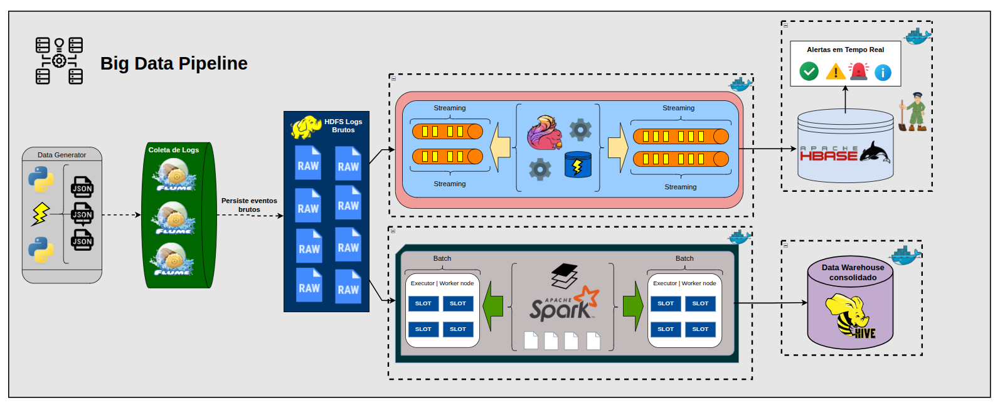

  <strong>Pipeline de Monitoramento Varejista</strong>

  Pipeline que combina processamento em tempo real (streaming) e em lote (batch) para monitorar cliques, carrinho e status de entrega.

 

  
  
  
  
  
  
  

  
  
  
  
  
  
  
  

  <a href="./docs/orientacion/principal.md">Equipe</a> • <a href="https://www.youtube.com/SEU_VIDEO">Video</a>

> **Documentação viva:** esta documentação encontra-se em evolução contínua e pode sofrer alterações conforme novos componentes, modelos são implementados.

---

## 📖 Visão Geral

O Laboratorio tem como objetivo principal a construção de um pipeline varejista que percore todas as etapas do ciclo de vida do dado, da geração ao armazenamento analítico. Cada camada abaixo corresponde a uma frente técnica do trabalho.

Esse projeto em questão utiliza diferentes tecnologias e ferramentas nao só pelas funcionalidades, mas sim porque cada componente possui uma
responsabilidade específica no ciclo de vida do dado.

Outra observação importante é que nenhuma das tecnologias anda competindo, pois cada uma atende padrões de processamento diferentes, como por exemplo o nosso Flink que trata o fluxo contínuo de eventos em tempo real, enquanto Spark processa o histórico em batch para consolidação analítica no Hive.

  

## 🏗️ Principios de Arquitetura
| Princípio                                       | Descrição                                                                                                          | Implementação na Plataforma                                                                                         |
| ----------------------------------------------- | ------------------------------------------------------------------------------------------------------------------ | ------------------------------------------------------------------------------------------------------------------- |
| Geração de Dados                      | Geração contínua e controlada de eventos representando o comportamento de usuários, vendas e operações logísticas. | data_generator utiliza Python 3 para produzir eventos JSON de cliques, carrinhos, pedidos e entregas, controlando volume, velocidade e timestamps.                  |
| Ingestão                          | Recepção, desacoplamento e distribuição contínua dos eventos para as camadas de processamento e armazenamento.                                         | Apache Flume coleta os eventos gerados e realiza a ingestão no ecossistema Hadoop, direcionando os dados para processamento e persistência.           |
|  Streaming                     | Processamento de eventos em tempo real considerando o tempo do evento e a chegada de dados fora de ordem.                                 | Apache Flink utiliza Event Time, Watermarks e Sliding Windows para processar eventos continuamente, identificar padrões.                       |
|    Batch                | Processamento histórico dos dados para limpeza, transformação, junção e geração de informações analíticas consolidadas.                                           | Apache Spark executa jobs de ETL utilizando RDDs, Spark SQL, agregações e joins, processando os dados históricos armazenados no HDFS.                                                |
|     Armazenamento                          | Separação das necessidades de armazenamento bruto, acesso de baixa latência e análise histórica.                                          | HDFS armazena os dados brutos em grande escala, HBase mantém alertas e resultados para consultas rápidas, e Hive organiza os dados consolidados como Data Warehouse.          |

### Camadas da Arquitetura

| Docs do Serviço | Responsabilidade |
| :--- | :--- |
| [`data-generator`](./src/data_generator/README.md) | Geração contínua de eventos JSON de cliques, carrinhos, pedidos e entregas. | PostgreSQL 
| [`ingestion`](./src/ingestion/README.md) | Ingestão e validação dos eventos utilizando Apache Flume. | PostgreSQL
| [`streaming`](./src/streaming/README.md) | Processamento em tempo real com Flink, watermarks, janelas deslizantes e alertas. | PostgreSQL 
| [`batch`](./src/batch/README.md) | Processamento histórico com Spark, ETL, RDDs, Spark SQL e joins. | PostgreSQL 
| [`storage`](./src/storage/READMEPRINCIPAL.md) | Integração com as camadas de armazenamento HDFS, HBase e Hive. | PostgreSQL 
| [`domain`](./src/domain/README.md) | Modelos e estruturas que representam os eventos e entidades do domínio. | MongoDB 
| [`monitoring`](./src/monitoring/README.md) | Métricas, alertas e monitoramento da execução da pipeline. | MongoDB 
| [`orchestration`](./src/orchestration/README.md) | Coordenação, execução e gerenciamento dos jobs de streaming e processamento batch da pipeline. | MongoDB 
| [`config`](./configs/README.md) | Configurações dos serviços e componentes da infraestrutura Big Data. | MongoDB 

---

# 🧭 Arquitetura, Fluxos e Diagramas

Esta seção apresenta os principais fluxos, componentes, testes e decisões arquiteturais implementados no pipeline.
As imagens abaixo representam diferentes estágios de desenvolvimento e teste e destinam-se a fornecer evidência visual operando com sucesso.

Os diagramas têm como objetivo facilitar a compreensão das interações entre as funcionalidades, infraestrutura e componentes do mesmo, servindo também como referência durante o desenvolvimento e evolução da arquitetura.

> Os screenshots são intencionalmente apresentados como evidência de implementação em vez de estarem atrelados a uma categoria específica de documentação. No entanto, 
cada camada tem suas imagens e explicaçao em suas devidas configurações.

> Nota: Os padrões apresentados nesta seção representam apenas os principais conceitos arquiteturais utilizados no desenvolvimento. A documentação completa de cada domínio pode conter outros padrões e estratégias específicas. Para conhecer as demais implementações, consulte os links disponíveis nas respectivas seções e documentações das suas respectivas camadas.

---

# Padrões de Arquitetura do Pipeline

## Fluxo de Dados

# Ingestão de Dados

### Coleta com Apache Flume

### Transporte e Entrega

# Processamento e Streaming

### Métricas do Desempenho
O processamento dos eventos é realizado de forma distribuída utilizando
Apache Flink, responsável pelo tratamento contínuo dos eventos recebidos
pela camada de ingestão.

Os eventos são produzidos pelo gerador Python em formato JSON e disponibilizados para o processo de ingestão. O Apache Flume acompanha o arquivo de eventos e encaminha os registros para o armazenamento em HDFS. O job Flink utiliza esses dados como fonte de streaming para iniciar o processamento.

 

A execução pode ser acompanhada por meio da interface do Flink, que
permite observar o volume processado e o estado dos operadores que durante a execução do ecommerce-streaming-job, o painel do Apache Flink registrou 12.400 registros recebidos pela fonte de processamento. Essa métrica representa eventos que efetivamente chegaram ao job durante a execução observada, permitindo demonstrar o funcionamento do fluxo de ingestão e processamento contínuo.

---

### Watermarks e Eventos Fora de Ordem

Neste pipeline utilizamos Event Time para determinar a posição temporal dos eventos a partir do campo event_timestamp, em vez de utilizar exclusivamente o instante em que o registro é recebido pelo Flink. Após o parsing e a validação dos eventos, o timestamp de cada registro é extraído e utilizado na atribuição dos timestamps e na geração dos watermarks.

 

O job utiliza uma estratégia de bounded out-of-orderness, configurada com uma tolerância de 10 segundos para eventos que chegam fora de ordem. O watermark representa uma estimativa do progresso do tempo de evento e permite que o Flink avance o processamento temporal mantendo uma margem para a chegada tardia de registros.

---

### Janelas Temporais Deslizantes 

A aplicação utiliza Sliding Windows baseadas em Event Time para realizar agregações contínuas sobre intervalos temporais sobrepostos. Cada janela possui 60 segundos de duração e é deslocada a cada 10 segundos, produzindo uma nova avaliação do fluxo em intervalos regulares.

  

Cada nova janela avança 10 segundos, enquanto mantém uma duração total de 60 segundos. Como consequência, existe uma sobreposição de 50 segundos entre duas janelas consecutivas.

 

Todos os eventos são posicionados nas janelas utilizando o Event Time associado ao event_timestamp. Dessa forma, a participação de um evento em uma janela é determinada pelo seu instante de ocorrência, e não simplesmente pelo momento em que o registro chegou ao operador.

---

### Batch

### Transformações e Joins

# Modelagem e Camadas de Dados

# Orquestração e Containers

# Monitoramento

# Testes

# Implementações Futuras

