

  <strong>Pipeline de Monitoramento Varejista</strong>

  Pipeline que combina processamento em tempo real (streaming) e em lote (batch) para monitorar cliques, carrinho e status de entrega.

 

  
  
  
  
  
  
  

  
  
  
  
  
  
  
  

  <a href="./docs/orientacion/principal.md">Equipe</a> • <a href="https://www.youtube.com/SEU_VIDEO">Video</a>

> **Documentação viva:** esta documentação encontra-se em evolução contínua e pode sofrer alterações conforme novos componentes, modelos são implementados.

---

## 📖 Visão Geral

O laboratório tem como objetivo principal a construção de um pipeline varejista que percorre todas as etapas do ciclo de vida do dado, desde a geração dos eventos até o armazenamento e a análise. Cada camada corresponde a uma frente técnica específica do trabalho.

O projeto utiliza diferentes tecnologias e ferramentas não apenas por suas funcionalidades, mas principalmente porque cada componente possui uma responsabilidade específica dentro do ciclo de vida dos dados.

O [Apache Flume](https://flume.apache.org/) atua como camada de ingestão, recebendo os eventos gerados pelo Python e distribuindo-os entre os diferentes caminhos da arquitetura. No caminho de streaming, os eventos são processados pelo [Apache Flink](https://flink.apache.org/) utilizando Event Time, watermarks e janelas deslizantes, permitindo o tratamento contínuo dos eventos e a geração de resultados em tempo real, que são persistidos no [Apache HBase](https://hbase.apache.org/).

Paralelamente, os eventos brutos são persistidos no [HDFS](https://hadoop.apache.org/), formando o histórico utilizado pelo processamento batch. Nesse caminho, o [Apache Spark](https://spark.apache.org/) processa os dados históricos utilizando RDDs e Spark SQL, realizando transformações, joins e agregações antes da consolidação dos resultados no [Apache Hive](https://hive.apache.org/), utilizado como camada de Data Warehouse para análise dos dados processados.

Dessa forma, a arquitetura separa os dois padrões de processamento: o Flink atende ao processamento contínuo dos eventos, enquanto o Spark utiliza o histórico persistido no HDFS para o processamento batch e a geração dos dados analíticos consolidados.

  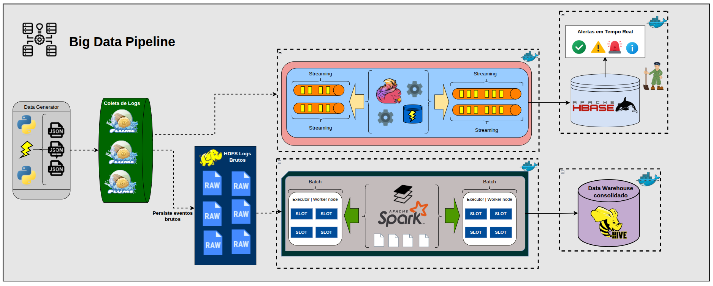

---

## 🏗️ Principios de Arquitetura
| Princípio                                       | Descrição                                                                                                          | Implementação na Plataforma                                                                                         |
| ----------------------------------------------- | ------------------------------------------------------------------------------------------------------------------ | ------------------------------------------------------------------------------------------------------------------- |
| Geração de Dados                      | Geração contínua e controlada de eventos representando o comportamento de usuários, vendas e operações logísticas. | data_generator utiliza Python 3 para produzir eventos JSON de cliques, carrinhos, pedidos e entregas, controlando volume, velocidade e timestamps.                  |
| Ingestão                          | Recepção, desacoplamento e distribuição contínua dos eventos para as camadas de processamento e armazenamento.                                         | Apache Flume coleta os eventos gerados e realiza a ingestão no ecossistema Hadoop, direcionando os dados para processamento e persistência.           |
|  Streaming                     | Processamento de eventos em tempo real considerando o tempo do evento e a chegada de dados fora de ordem.                                 | Apache Flink utiliza Event Time, Watermarks e Sliding Windows para processar eventos continuamente, identificar padrões.                       |
|    Batch                | Processamento histórico dos dados para limpeza, transformação, junção e geração de informações analíticas consolidadas.                                           | Apache Spark executa jobs de ETL utilizando RDDs, Spark SQL, agregações e joins, processando os dados históricos armazenados no HDFS.                                                |
|     Armazenamento                          | Separação das necessidades de armazenamento bruto, acesso de baixa latência e análise histórica.                                          | HDFS armazena os dados brutos em grande escala, HBase mantém alertas e resultados para consultas rápidas, e Hive organiza os dados consolidados como Data Warehouse.          |

### Camadas da Arquitetura

| Docs do Serviço | Responsabilidade |
| :--- | :--- |
| [`data-generator`](./src/data_generator/README.md) | Geração contínua de eventos JSON de cliques, carrinhos, pedidos e entregas. | PostgreSQL 
| [`ingestion`](./src/ingestion/README.md) | Ingestão e validação dos eventos utilizando Apache Flume. | PostgreSQL
| [`streaming`](./src/streaming/README.md) | Processamento em tempo real com Flink, watermarks, janelas deslizantes e alertas. | PostgreSQL 
| [`batch`](./src/batch/README.md) | Processamento histórico com Spark, ETL, RDDs, Spark SQL e joins. | PostgreSQL 
| [`storage`](./src/storage/READMEPRINCIPAL.md) | Integração com as camadas de armazenamento HDFS, HBase e Hive. | PostgreSQL 
| [`domain`](./src/domain/README.md) | Modelos e estruturas que representam os eventos e entidades do domínio. | MongoDB 
| [`monitoring`](./src/monitoring/README.md) | Métricas, alertas e monitoramento da execução da pipeline. | MongoDB 
| [`orchestration`](./src/orchestration/README.md) | Coordenação, execução e gerenciamento dos jobs de streaming e processamento batch da pipeline. | MongoDB 
| [`config`](./configs/README.md) | Configurações dos serviços e componentes da infraestrutura Big Data. | MongoDB 

---

# 🧭 Arquitetura, Fluxos e Diagramas

Esta seção apresenta os principais fluxos, componentes, testes e decisões arquiteturais implementados no pipeline.
As imagens abaixo representam diferentes estágios de desenvolvimento e teste e destinam-se a fornecer evidência visual operando com sucesso.

Os diagramas têm como objetivo facilitar a compreensão das interações entre as funcionalidades, infraestrutura e componentes do mesmo, servindo também como referência durante o desenvolvimento e evolução da arquitetura.

> Os screenshots são intencionalmente apresentados como evidência de implementação em vez de estarem atrelados a uma categoria específica de documentação. No entanto, 
cada camada tem suas imagens e explicaçao em suas devidas configurações.

> Nota: Os padrões apresentados nesta seção representam apenas os principais conceitos arquiteturais utilizados no desenvolvimento. A documentação completa de cada domínio pode conter outros padrões e estratégias específicas. Para conhecer as demais implementações, consulte os links disponíveis nas respectivas seções e documentações das suas respectivas camadas.

---

# Padrões de Arquitetura e Tratamento do Pipeline

### Coleta com Apache Flume

O Apache Flume atua como a camada de ingestão do pipeline, recebendo continuamente os eventos gerados pelo Python e encaminhando os dados para os destinos definidos na arquitetura. Sua estrutura é baseada no fluxo Source → Channel → Sink, permitindo desacoplar a coleta dos eventos das etapas posteriores de processamento e armazenamento.

  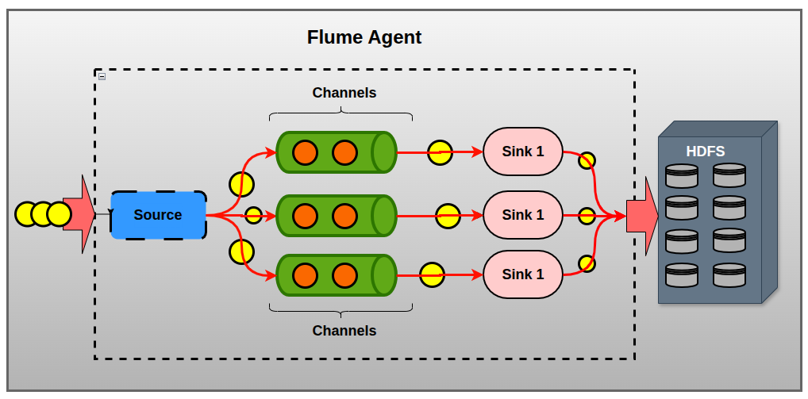

A arquitetura do agente organiza o caminho percorrido pelos eventos desde a entrada até a entrega, mantendo a ingestão contínua enquanto os dados são encaminhados para as próximas camadas do pipeline.

### Transformação e Entrega

Após a ingestão, os eventos são encaminhados para a camada de armazenamento, onde os dados brutos são persistidos no HDFS. Essa etapa mantém o histórico dos eventos disponível para o processamento batch realizado posteriormente pelo Apache Spark.

  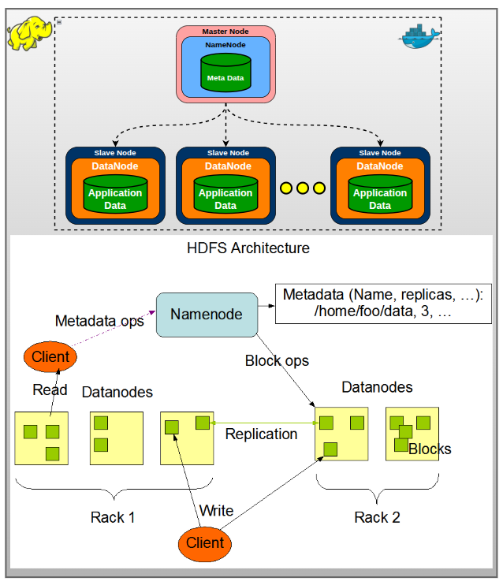

O HDFS funciona como a camada distribuída de armazenamento do pipeline, mantendo os dados históricos organizados para que possam ser posteriormente lidos, transformados e processados pelo Spark antes da consolidação no Hive.

---

# Processamento Streaming 🐿️

### Métricas do Desempenho
O processamento dos eventos é realizado de forma distribuída utilizando Apache Flink, responsável pelo tratamento contínuo dos eventos recebidos pela camada de ingestão.

Os eventos são produzidos pelo gerador Python em formato JSON e disponibilizados para o processo de ingestão. O Apache Flume realiza a ingestão dos eventos e os encaminha para o fluxo de processamento em streaming, enquanto os registros brutos também são persistidos no HDFS para posterior processamento batch. O job Flink utiliza os eventos recebidos pela camada de ingestão como fonte de streaming para iniciar o processamento.

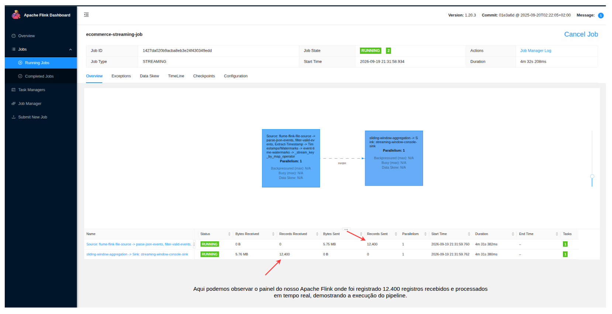 

A execução pode ser acompanhada por meio da interface do Flink, que permite observar o volume processado e o estado dos operadores. Durante a execução do `ecommerce-streaming-job`, o painel do Apache Flink registrou 12.400 registros recebidos pela fonte de processamento. Essa métrica representa eventos que efetivamente chegaram ao job durante a execução observada, permitindo demonstrar o funcionamento do fluxo de ingestão e processamento contínuo.

---

### Watermarks e Eventos Fora de Ordem

Neste pipeline utilizamos Event Time para determinar a posição temporal dos eventos a partir do campo event_timestamp, em vez de utilizar exclusivamente o instante em que o registro é recebido pelo Flink. Após o parsing e a validação dos eventos, o timestamp de cada registro é extraído e utilizado na atribuição dos timestamps e na geração dos watermarks.

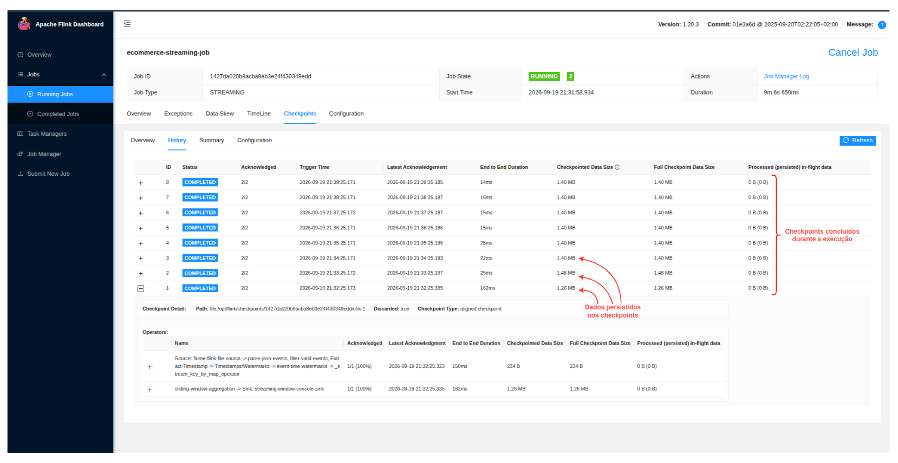 

O job utiliza uma estratégia de bounded out-of-orderness, configurada com uma tolerância de 10 segundos para eventos que chegam fora de ordem. O watermark representa uma estimativa do progresso do tempo de evento e permite que o Flink avance o processamento temporal mantendo uma margem para a chegada tardia de registros.

---

### Janelas Temporais Deslizantes 

A aplicação utiliza Sliding Windows baseadas em Event Time para realizar agregações contínuas sobre intervalos temporais sobrepostos. Cada janela possui 60 segundos de duração e é deslocada a cada 10 segundos, produzindo uma nova avaliação do fluxo em intervalos regulares.

  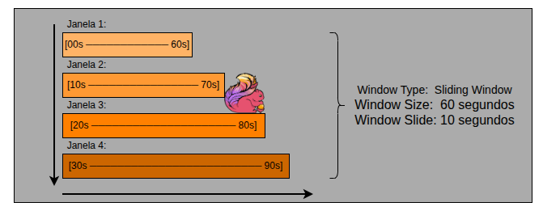

Cada nova janela avança 10 segundos, enquanto mantém uma duração total de 60 segundos. Como consequência, existe uma sobreposição de 50 segundos entre duas janelas consecutivas.

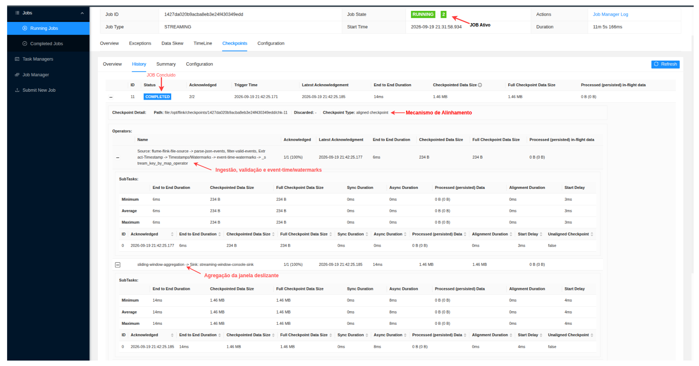 

Todos os eventos são posicionados nas janelas utilizando o Event Time associado ao event_timestamp. Dessa forma, a participação de um evento em uma janela é determinada pelo seu instante de ocorrência, e não simplesmente pelo momento em que o registro chegou ao operador.

---

# Processamento Batch 📦

### Execução dos Jobs no Apache Spark

Chegando ao processamento em lote, que pode ser analisado por meio da interface do Spark, a aplicação executou diferentes operações de processamento e transformação sobre os dados históricos. A interface permite acompanhar o relacionamento entre as operações realizadas e os Jobs Spark responsáveis pela execução dessas etapas.

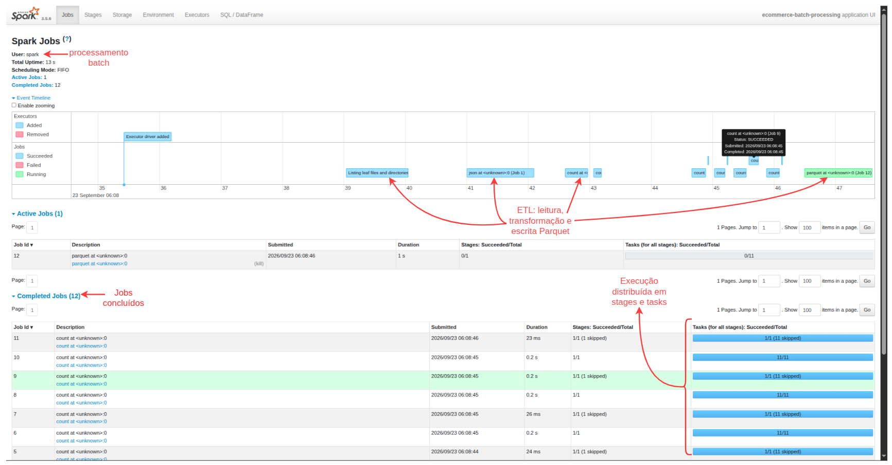 

A execução dos Jobs representa a etapa de processamento batch do pipeline, na qual o Apache Spark realiza as transformações sobre o histórico de dados e disponibiliza os resultados para as etapas analíticas posteriores no Hive.

---

### Transformações ETL SQL / DATAFRAME

Ja na transformaçao batch, o Spark realiza o ETL sobre os dados históricos. Primeiro fazemos a leitura dos arquivos, depois aplicamos filtros e, por fim, uma agregação para gerar os indicadores. Durante a agregação ocorre um Exchange, caracterizando uma wide dependency e permitindo observar o shuffle produzido pelo processamento distribuído.

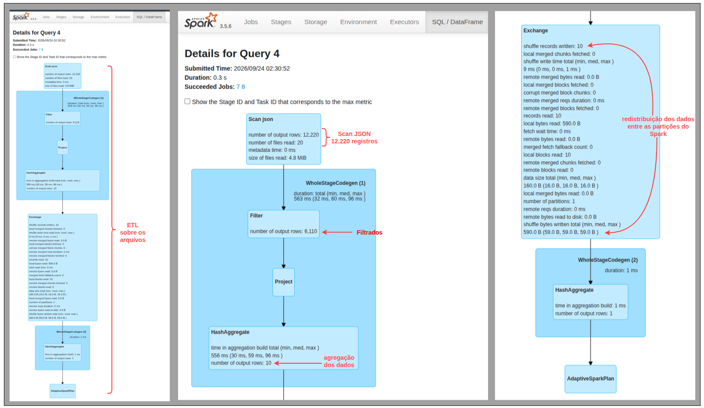 

A execução apresentada na interface **SQL / DataFrame** permite observar detalhadamente o plano físico utilizado pelo Spark durante o processamento.

O **Scan JSON** representa a leitura dos dados históricos. Nessa execução, foram lidos **20 arquivos**, totalizando **12.220 registros**. Após a aplicação do `Filter`, o conjunto é reduzido para **6.110 registros**, mantendo apenas os dados relevantes para o processamento.

Na sequência, o `Project` realiza a seleção e transformação das colunas utilizadas na análise. O processamento então chega ao `Exchange`, responsável pela redistribuição dos dados entre as partições. Essa etapa gera o **shuffle** e caracteriza uma **wide dependency**, pois os dados precisam ser reorganizados entre diferentes partições para que a etapa seguinte possa ser executada.

Por fim, o `HashAggregate` consolida os dados e produz **10 registros de saída**. A agregação apresentou aproximadamente **556 ms de tempo total**, com **96 ms como maior tempo observado** entre as tarefas.

Essas métricas permitem acompanhar não somente o resultado do ETL, mas também o comportamento do processamento distribuído, mostrando o volume de dados em cada etapa, a redistribuição realizada pelo shuffle e a agregação utilizada para gerar os indicadores.

---

# Configuração e Camadas de Dados

### HBase para alertas em tempo real do Flink

O HBase foi configurado como camada NoSQL dos dados processados pelo Apache Flink  que foi validada diretamente na tabela ecommerce:realtime_alerts do Apache HBase. Onde, após o processamento das janelas deslizantes, as agregações produzidas pelo Flink são persistidas no HBase utilizando o HappyBase, através do serviço HBase Thrift na porta 9090.

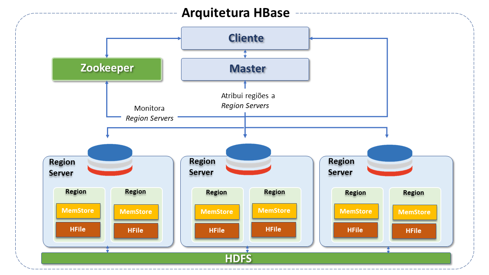 

O Apache HBase é utilizado como camada de persistência para os resultados produzidos pelo processamento de streaming realizado pelo Apache Flink. Durante a execução do pipeline, os eventos são processados por janelas temporais deslizantes e, ao final de cada janela, são produzidas agregações contendo as métricas calculadas pelo processamento.

 

---

### Persistencia em Disco das Streaming

Essas agregações são persistidas na tabela `ecommerce:realtime_alerts`. A integração entre o Flink e o HBase é realizada através do **HappyBase**, utilizando o **HBase Thrift Server na porta 9090**. Dessa forma, o resultado do processamento não permanece apenas no estado interno do job do Flink, sendo materializado em uma estrutura persistente que pode ser consultada posteriormente.

 

A consulta apresentada na figura confirma a persistência efetiva dos resultados produzidos pelo processamento do Flink. As linhas retornadas possuem o padrão `WINDOW_AGGREGATION` e estão associadas a diferentes clientes, demonstrando que as agregações foram materializadas individualmente na tabela `ecommerce:realtime_alerts`.

---

# Data-Warehouse Consolidado

### Hive para Analise de Negocio

O Apache Hive é utilizado como camada de persistência e consulta analítica dos dados processados pelo Apache Spark. Após a leitura dos eventos armazenados no HDFS, o processamento batch realiza as etapas de transformação, limpeza, normalização, conversão de tipos, joins e agregações necessárias para estruturar os dados do Data Warehouse.

Os resultados são persistidos no banco `ecommerce_dw`, que contém tabelas específicas para diferentes categorias de eventos e informações analíticas, incluindo `click_events`, `sales_events`, `delivery_events`, `cart_events` e `daily_sales_summary`.

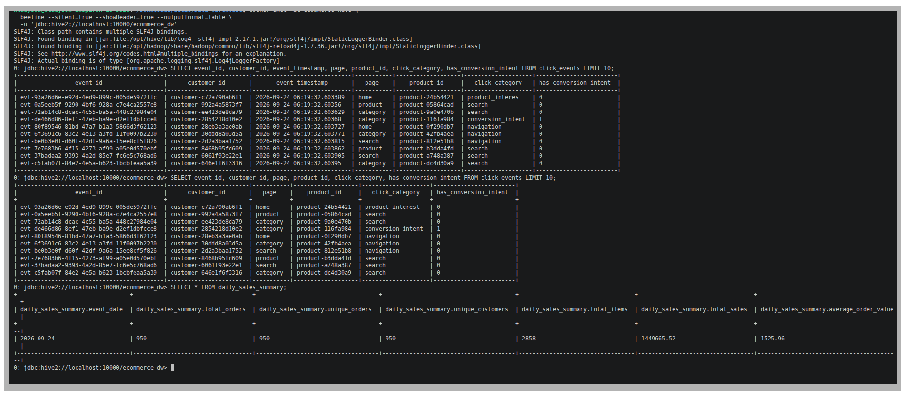 

Na tabela `click_events`, os registros apresentam os atributos estruturados dos eventos de interação, incluindo `event_id`, `customer_id`, `event_timestamp`, `page`, `product_id`, `click_category` e `has_conversion_intent`. Isso demonstra a materialização dos dados de eventos após o processamento batch.

A consulta sobre `daily_sales_summary` demonstra a etapa de agregação analítica do pipeline. Para a data `2026-09-24`, foram registrados **950 pedidos**, **950 pedidos distintos**, **950 clientes únicos** e **2.858 itens**, com volume total de vendas de `1.449.665,52` e valor médio por pedido de `1.525,96`.

---

# Orquestração e Containers

